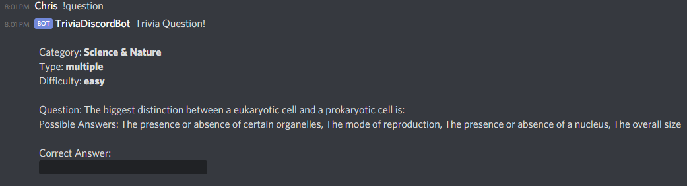

# Trivia Discord Bot

This is a simple Trivia Discord Bot. It uses the [Open Trivia Database](https://opentdb.com/) to get the questions, and the [Discord.Net](https://www.nuget.org/packages/Discord.Net/) NuGet package to integrate with Discord.  
This is to be used as an introduction to developing .Net core Discord Apps.

## Build

You'll need .Net Core SDK 3.1 or newer, which can be found on their [website](https://dotnet.microsoft.com/download).  
To build run the following command in the root folder.

    dotnet build

## Run

To run the code, you will need to setup a Discord application and bot by following [this documentation](https://discord.foxbot.me/latest/guides/getting_started/first-bot.html#creating-a-discord-bot). Once that is done you will need to take the Token created for your bot and paste it into the "DiscordToken" appsetting found in `TriviaDiscordBot/appsettings.json`.  
Now you can run the application by running the following command in the root of the repo.

    dotnet run --project TriviaDiscordBot

## How to use the bot

First you will need to add your bot to your server using the documentation found [here](https://discord.foxbot.me/latest/guides/getting_started/first-bot.html#adding-your-bot-to-a-server). Once that is done all you should need to do is run the project and type `!question` into a text channel in the server you added the bot to.

## Features still needed

- Ability to set difficulty
- Ability to specify specific Category
- Command to explain all the question command and what categories are available